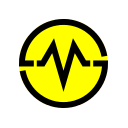
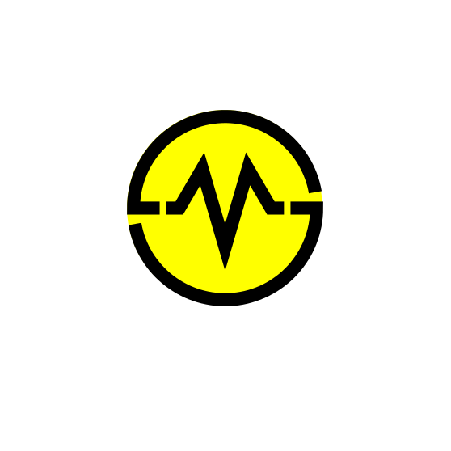

# my-logos

My personal hand-coded, WCAG and SVG2 compliant logo, with derivatives generated by https://realfavicongenerator.net.

## Hand-coded Icons

| filename | description |
| --- | --- |
| [mylogo-legacy.svg](./mylogo-legacy.svg) | The original logo coloring. |
| [safari-pinned-tab.svg](./safari-pinned-tab.svg) | The mono-colored icon that users see when they pin a website in Safari: `<link rel="mask-icon" href="safari-pinned-tab.svg" color="black">`. *NOTE: This is not the file provided by https://realfavicongenerator.net.  That file was rasterized, and although smaller in size, non-optimal.* |

## Generated Code

| filename | description |
| --- | --- |
| [html_code.html](./html_code.html) | Code fragment to be included in an HTML documentʻs `<head>` to properly apply these icons. |
| [site.webmanifest](./site.webmanifest) | Example of including icons in a site.webmanifest file, which is used by websites that can be installed to a device’s homescreen. |
| [browserconfig.xml](./site/browserconfig.xml) | By default, IE11 looks for browserconfig.xml at the root of the web site.  It is loaded only by Windows 8 devices.  It defines the various tile pictures and background color. |

## Generated Icons

| filename | thumbnail | description |
| --- | --- | --- |
| [apple-touch-icon.png](./apple-touch-icon.png) |  |  The icon that users see when they access a website from the iOS home screen: `<link rel="apple-touch-icon" sizes="180x180" href="/apple-touch-icon.png">` |
| [favicon.ico](./favicon.ico) |  | The icon that shows to the left of the URL. |
| [favicon-16x16.png](./favicon-16x16.png) |  | The icon that shows to the left of the URL: `<link rel="icon" type="image/png" sizes="16x16" href="/favicon-16x16.png">` |
| [favicon-32x32.png](./favicon-32x32.png) |  | The icon that shows to the left of the URL: `<link rel="icon" type="image/png" sizes="32x32" href="/favicon-32x32.png">` |
| [android-chrome-192x192.png](./android-chrome-192x192.png) |  | Referenced by [site.webmanifest](./site.webmanifest). |
| [android-chrome-512x512.png](./android-chrome-512x512.png) |  | Referenced by [site.webmanifest](./site.webmanifest). |
| [mstile-70x70.png](./mstile-70x70.png) |  | May be referenced by the Microsoft proprietary meta tag `msapplication-square70x70logo`. |
| [mstile-144x144.png](./mstile-144x144.png) |  | IE10 Metro tile for pinned site. |
| [mstile-150x150.png](./mstile-150x150.png) |  | Referenced by [browserconfig.xml](./site/browserconfig.xml).  May also be referenced by the Microsoft proprietary meta tag `msapplication-square150x150logo`. |
| [mstile-310x150.png](./mstile-310x150.png) |  | May be referenced by the Microsoft proprietary meta tag `msapplication-wide310x150logo`. |
| [mstile-310x310.png](./mstile-310x310.png) |  | May be referenced by the Microsoft proprietary meta tag `msapplication-square310x310logo`. |

